# Unity: Simple Wave Based 3D Game 


[TOC]

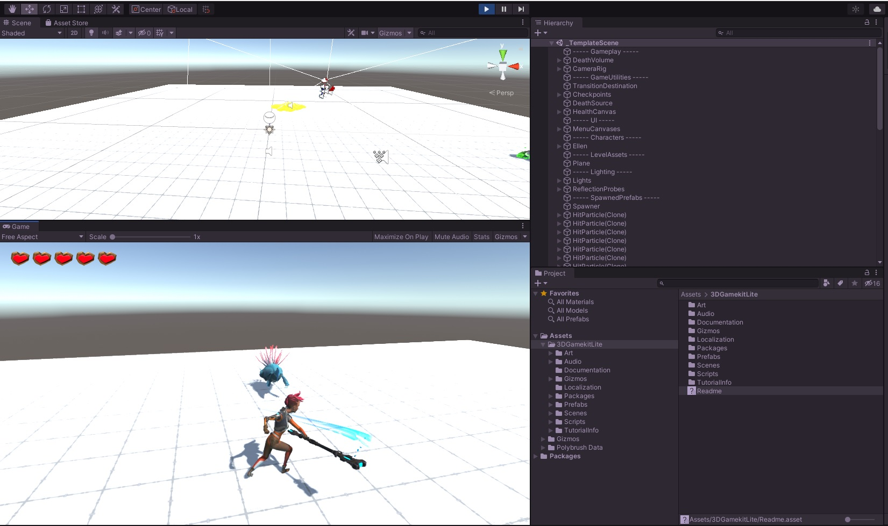


### Created by Andrew Hannay: andrew.hannay@gmail.com

## Lesson Requirements: 

Unity Version 2018.3.0 or higher:  [https://unity3d.com/get-unity/download](https://unity3d.com/get-unity/download)

**This project works best using Unity Hub**

3D Game Kit Lite: [shorturl.at/efnT6](shorturl.at/efnT6])


## Lesson Overview and Objectives:

In this lesson, you will use the Unity 3D game kit lite, to create a simple wave based action game. The player will face increasing waves of enemies, each larger than the last. Each time the player kills all the enemies, the next wave will start, adding one more enemy.  

In completing this lesson, You will learn the basics of:

- Using Prefabs

- Instantiating (spawning) enemies

- Spawning a randomly chosen enemy from a list

- Spawning enemies to a random location

- Repeating the spawning process with a For-loop

- Increment the wave value in the loop with the ++ operator

- tagging objects and targeting objects in the game by looking for Tags

- return the length of a list using .Length

  

## Step 1. Setting Up. 

Download and install Unity 2018.3.0 or higher. 

**This project works best using Unity Hub**

Once downloaded and installed got to Unity Hub and click on the "Learn" tab on the left. 

Under projects, scroll down and find "3D Game Kit Lite"

Click on it and click "Download Project". 

Once the project has downloaded, click "Open Project"

The Project will now open (*This may take a little while*).


## Step 2. Setting the Scene

All action in Unity happens in a "scene". So to get started, we will make a new Scene. 

Go to **Kit Tools > Create New Scene.**

Name your scene whatever you like. 

Select **Create.** 

You will see a scene with a flat ground and an empty environment *(N.B. your layout will probably look different to the image below).*

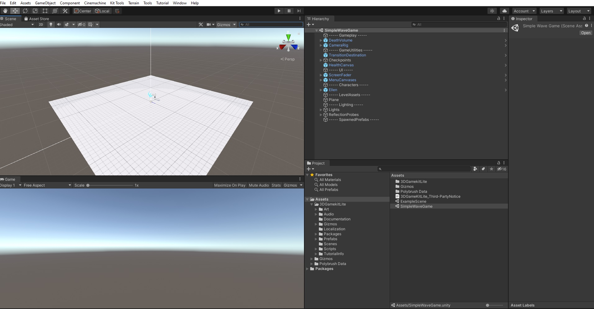

Press play at the top of the editor to try your new scene out. 


This game kit comes with some simple assets and scripts already built in. When you play your scene, you will see the player "Ellen" in the center of the screen, and be able to control her with the mouse and keyboard (W,S,A,D,). When finished, press escape and select quit. 

Next go to **Assets > 3DGamekitLite > Prefabs > Characters > Enemies > Chomper**

Click on the "Chomper" and drag it into the "Hierarchy". You should now see our first enemy, the Chomper, appear next to Ellen. 

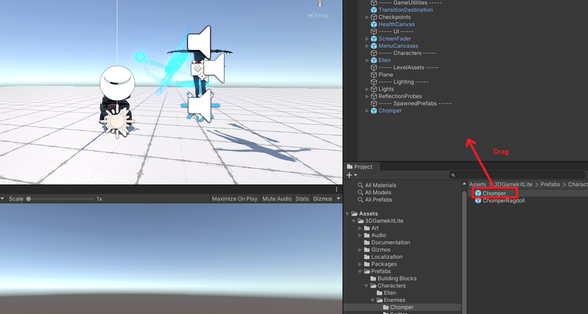

Now if you press play again, you will see an angry chomper on in the scene next to Ellen. He seems to be running, but never reaches our player!


## Step 3. Bringing Enemies to life. 

Our chomper is trying to get to Ellen, but doesn't know how to find her. To fix this we need to add a Nav Mesh Surface to the ground. 

In the Hierarchy, select the "Plane", this is the flat surface of our game. 

With the Plane selected, in the "Inspector" window, scroll to the very bottom and click "Add Component"


Now, from the menu that appears, select "NavMeshSurface". If you have trouble finding it, you can add search terms at the top of the menu. 

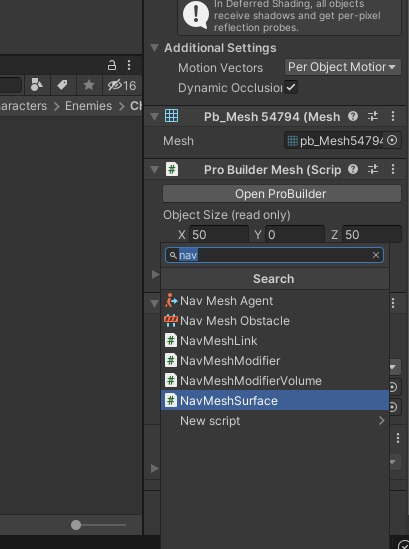

Now, in your newly added NavMeshSurface, set the "Agent Type" to Chomper. 

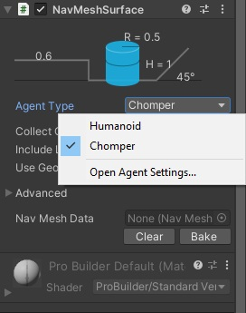

Then, similarly, in the "Include Layers" menu, first select nothing, then select "Environment" and "Vegetation". It will then change it's name to "mixed". 

Now, under "Nav Mesh Data", select "Bake": 

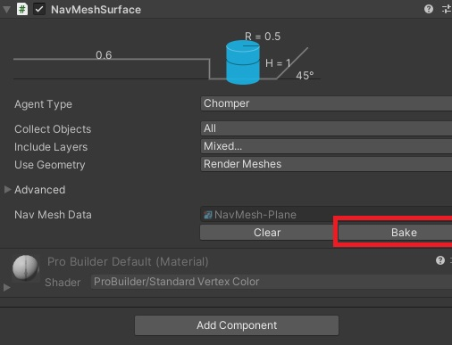

Now the plane will turn blue in the scene view. Now if you press play again, our chomper will chase Ellen and attack her!! Quick, kill it!

The Nav Mesh Surface is a special "mesh" that tells our chomper where it can and can't go. If you click on our chomper, you will notice it already comes with a Nav Mesh Agent component built in. Don't change any of these values just yet, but just know that in making your own games from scratch in the future, you will need to add these components and and set their parameters. 

For more detailed advanced information on Nav Meshes  and agents if you are interested: 

​	 [Nav Mesh Surface](https://docs.unity3d.com/Manual/class-NavMeshSurface.html)

​	[Nav Mesh Agent](https://docs.unity3d.com/Manual/class-NavMeshAgent.html)  

(*check these links out if you like knowing the specifics of how things work, but also, don't get too worried about these details just now :)* ) 

**Now might be a good time to save your work.** 

Remember to save regularly!

## Step 4. Spawning Enemies

Now we have a basic game world set up and our enemies can find our player, we want to create a script to spawn enemies into the game. 

**to** do this we will first need something to attach our script to. Right click on the Hierarchy and select **Create Empty** . 

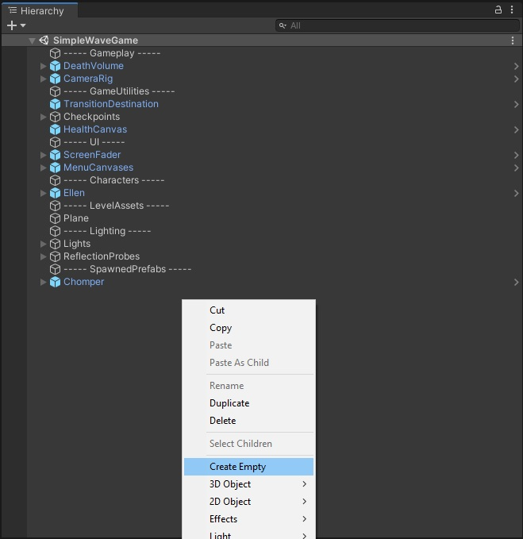


Rename our new empty game object by right clicking it or by changing it's name property in the "inspector" window. For this example we will name it **EnemySpawner**. 

Now, in the "Project" window, navigate to the scripts folder: **Assets > 3DGamekitLite > Scripts** 

Right click and select **Create > C# Script**. 

Rename our new script **SpawnEnemy**. 

Click on our new SpawnEnemy script in the project window, and drag it onto the EnemySpawner in the Hierarchy window. 

You will know you have done it correctly when  you see the Spawn Enemy script appear in the inspector when the Enemy Spawner is selected: 

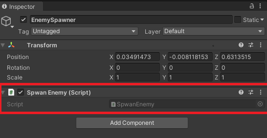

Now, start editing the script by double clicking on it in the project window. 

By default, all Unity scripts contain a set of pre determined instructions. Your scripts should look like the following:

```c#
using System.Collections;
using System.Collections.Generic;
using UnityEngine;

public class SpawnEnemy : MonoBehaviour
{
       
    // Start is called before the first frame update
    void Start()
    {
        
    }

    // Update is called once per frame
    void Update()
    {
        
    }
}

```

First we will declare a variable for our enemy. We do this just above Start(). We declare our varible with the following:

```c#
public GameObject chomperPrefab;
```

Now your script should look like this:

```c#
using System.Collections;
using System.Collections.Generic;
using UnityEngine;

public class SpawnEnemy : MonoBehaviour
{
    public GameObject chomperPrefab; 
    
    // Start is called before the first frame update
    void Start()
    {
        
    }

    // Update is called once per frame
    void Update()
    {
        
    }
}
```

Now, back in the Unity Editor, if you click on the EnemySpawner in the hierarchy, and then look at it's properties in the inspector, you will see our Chomper Prefab variable appear. At the moment it will say **None (Game Object).** 

So now we need to drag our Chomper prefab into this slot. 

***<u>Important</u>*** : Do not drag the chomper from the Hierarchy into the slot, infact, we want to delete that one. Instead we will use the prefab found in **Assets > 3DGamekitLite > Prefabs > Characters > Enemies > Chomper**. 

So go ahead and delete the chomper from the hierarchy (it will disappear from the game scene, but don't worry, we will spawn it back with our script), and drag the prefab into the slot Chomper prefab in your script. 

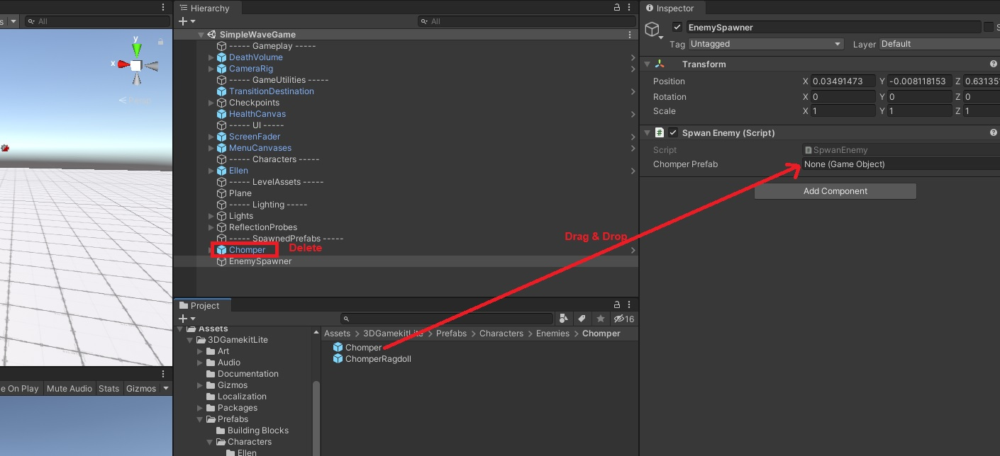


Now we have our script referring to the correct prefab, lets spawn our enemy in. 

Open up the SpawnEnemy script again, and find Start() . Between the two braces {} add the following lines. 

```c#
 void Start()
    {
        Vector3 spawnPoint = new Vector3(-8, 0, 0);
        Instantiate(chomperPrefab, spawnPoint, chomperPrefab.transform.rotation); 
    }
```

The first line defines a Vector3, a position in 3D space, with an x,y,z component.

The next line "instantiates"  or makes a copy of our object in the game world. This is a function that takes three *arguments* (values that are passed around to different parts of the code). These arguments in order are: 

- The object you want to create a copy of (the chomper prefab)

- The object's position in the 3D space of the game world (our already defined spawnPoint variable)

- The object's rotation in 3D space (this this case, we just used the prefabs existing rotation)

Now save your scrip and run your game, your chomper should appear in the game world just after running. Quick kill it!!!


## Step 5. Spawning Enemies to a Random Position

Now we have our enemy spawner set up, and it is spawning our chomper into the game. Now let's make it spawn in at a random position, rather than the same point each time. 

In your SpawnEnemy script, recall that we set the position with the Vector 3 we defined earlier, which has and x,y & z, component. To create a random position, we will need to generate a random number assigned to our x and y values (y is up and down, so we will leave that as 0). 

To do this, back near the start of your script, below where you declared the variable for the chomper, (public GameObject chomperPrefab;) create two new variable using the following two lines:

```c#
private float xRange = 20;
private float zRange = 15; 
```

Now, we will use these two numbers to create a random x and z position. We do this using Random.Range(), which requires two arguments, a lower and upper range.   Back inside Start() but above your  existing code, add the following : 

```c#
float spawnX = Random.Range(-xRange, xRange);
float spawnZ = Random.Range(-zRange, zRange);
```

Now, we will use these randomly generated numbers in spawnPoint variable on the next line. Replace the x and z values with our new random variables so it now appears as follows: 

```c#
Vector3 spawnPoint = new Vector3(spawnX, 0, spawnZ);
```

At this point, your entire SpawnEnemy script should look like this:

```c#
using System.Collections;
using System.Collections.Generic;
using UnityEngine;

public class SpawnEnemy : MonoBehaviour
{
    public GameObject chomperPrefab;
    private float xRange = 20;
    private float zRange = 15; 
    // Start is called before the first frame update
    void Start()
    {
       
        float spawnX = Random.Range(-xRange, xRange);
        float spawnZ = Random.Range(-zRange, zRange);
        Vector3 spawnPoint = new Vector3(spawnX, 0, spawnZ);
        Instantiate(chomperPrefab, spawnPoint, chomperPrefab.transform.rotation); 
    }

    // Update is called once per frame
    void Update()
    {
        
    }
}
```

Now test your game by running it and stopping, then running again a few times. Your should now find that the chomper spawns in at a different position each time! 

 


## Step 6. Spawning Random Enemies from a List

So, now we have our enemy spawning in to a random position, but it is always the same enemy type. Later on when we create growing waves, we will want to have some variety, so, we will set up an "array" and randomly choose which enemy to spawn in. Arrays are like a list, and allow you to store multiple objects in a single variable. 

To create our array, we add the following line to our SpawnEnemy list, add it at the top, just under the other variables for x and zRange:

```c#
 // creates an array for enemy prefabs
    public GameObject[] enemyPrefabs; 
```

Save your script and switch back to the Unity editor. Select your EnemySpawner Game Object in the hierarchy. You should now see the EnemyPrefabs object in the inspector. Change the size from 0 to 2 and 2 empty element fields will appear:

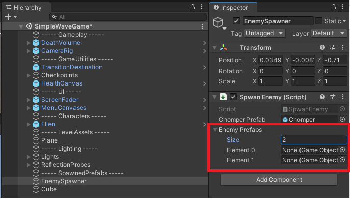


No we will populate these two empty slots. In the project window, navigate to **Assets > 3DGamekitLite > Prefabs > Characters > Enemies** . You will notice there are two folders, chomper and spitter, each with a prefab and a "ragdoll". Ignore the ragdoll for now, and drag both the chomper and spitter prefabs into the empty slots in your enemy prefabs array under the EnemySpawner object. 

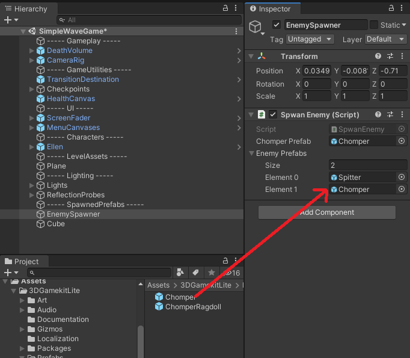

Now, we need to create an index variable, which represents which position in the array we are choosing (0 or 1 \ spitter or chomper). We also want this to be a random number so that we can choose either a spitter or chomper to spawn in randomly. We want the random number to be between 1 and the length of our array list. 

In the SpawnEnemy script, add the following line at the top of Start():

```c#
    int enemyIndex = Random.Range(0, enemyPrefabs.Length); 
```

Now, inside our instantiate call, we replace the chomperPrefab, with the randomly chosen prefab from our array, by replacing the line:

```c#
Instantiate(chomperPrefab, spawnPoint, chomperPrefab.transform.rotation); 
```

with the following:

```c#
    Instantiate(enemyPrefabs[enemyIndex], spawnPoint, chomperPrefab.transform.rotation); 
```

Now if you save the script, and run and re-run the game, you should get a random enemy spawn in each time. *(Remember, there are only two types, so it may take several tries before you get a different enemy. )*

Now, we want to tidy up our code, by creating a new method. Notice, everything inside Start() performs a single task; spawning a random enemy, to a random position. Because it is all related to a single task, it makes sense to make this it's own method. 

At the very bottom of the script, but above the last brace }, create a new method called SpawnRandomEnemy() by adding the following:

```c#
void SpawnRandomEnemy()
    {
        
    }
```

Now, cut everything inside Start(), and paste it into our new method. It should look like this: 

```c#
void SpawnRandomEnemy()
    {
        int enemyIndex = Random.Range(0, enemyPrefabs.Length);
        float spawnX = Random.Range(-xRange, xRange);
        float spawnZ = Random.Range(-zRange, zRange);
        Vector3 spawnPoint = new Vector3(spawnX, 0, spawnZ);
        Instantiate(enemyPrefabs[enemyIndex], spawnPoint, chomperPrefab.transform.rotation);
    }
```

Finally, inside Start(), call the new method with the following line:

```c#
 void Start()
    {
        SpawnRandomEnemy(); 
    }
```

Now we will create yet another method, this time to contain the code we have written to generate the random position. 

Below your SpawnRandomEnemy() method, create a GenerateRandomPosition() method like follows:

```c#
private Vector3 GenerateRandomPosition()
{

}
```

Inside your script, cut the middle 3 lines from the SpawnRandomEnemy() method, and paste them in GenerateRandomPosition(). Then add a line to return our spawnPoint variable so it can be used elsewhere. You method should now look like this:

```c#
   private Vector3 GenerateRandomPosition()
    {
        
        float spawnX = Random.Range(-xRange, xRange);
        float spawnZ = Random.Range(-zRange, zRange);
        Vector3 spawnPoint = new Vector3(spawnX, 0, spawnZ);
        return spawnPoint; 
    }
```

Finally, in the instantiate line in SpawnRandomEnemy(), replace spawnPoint, with a call to GenerateRandomPosition(): 

```c#
   Instantiate(enemyPrefabs[enemyIndex], GenerateRandomPosition(), chomperPrefab.transform.rotation);
```

Save and run the script, and it should work exactly as before. However, our work is much neater, and readable. 

At this stage, the whole script should look like this:

```c#
using System.Collections;
using System.Collections.Generic;
using UnityEngine;

public class SpawnEnemy : MonoBehaviour
{
    public GameObject chomperPrefab;
    private float xRange = 20;
    private float zRange = 15;
    // creates an array for enemy prefabs
    public GameObject[] enemyPrefabs;

    
    // Start is called before the first frame update
    void Start()
    {
        SpawnRandomEnemy(); 
    }

    // Update is called once per frame
    void Update()
    {
        
    }

    void SpawnRandomEnemy()
    {
        
           int enemyIndex = Random.Range(0, enemyPrefabs.Length);
            Instantiate(enemyPrefabs[enemyIndex], GenerateRandomPosition(), chomperPrefab.transform.rotation);
       
        
    }

    private Vector3 GenerateRandomPosition()
    {
        
        float spawnX = Random.Range(-xRange, xRange);
        float spawnZ = Random.Range(-zRange, zRange);
        Vector3 spawnPoint = new Vector3(spawnX, 0, spawnZ);
        return spawnPoint; 
    }
}

```


## Step 7. Wave After Wave

Now we have a random enemy spawning in at the start of the game, to a random position. But just one enemy is not much fun. Now we will add waves of enemies, that increase each time we have killed all the enemies in a wave!

To start this off, we are going to spawn three enemies in the first wave. To do this we will use a for loop. The basic structure of a for loop the runs three times looks like this:

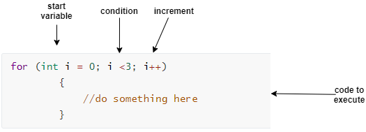


So, we will add this for loop to our SpawnRandomEnemy() method, and put all the code inside the loop, as follows:

```c#
    void SpawnRandomEnemy()
    {
        for (int i = 0; i < 3; i++)
        {
           
            Vector3 spawnPoint = new Vector3(spawnX, 0, spawnZ);
            Instantiate(enemyPrefabs[enemyIndex], GenerateRandomPosition(), chomperPrefab.transform.rotation);
         }
     }
```

Now, if you save and run, three enemies should spawn in rather than just one. 

Now, to spawn waves of enemies, we need to keep track of our wave number, and increase it each time all our enemies are killed. 

Firstly, to track how many enemies there are left, we need to tag both our enemy prefabs. Navigate to  **Assets > 3DGamekitLite > Prefabs > Characters > Enemies**. With one of your enemy prefabs selected, at the very top of the inspector, you will notice the tag property states "untagged". click on this and select "Add Tag". 

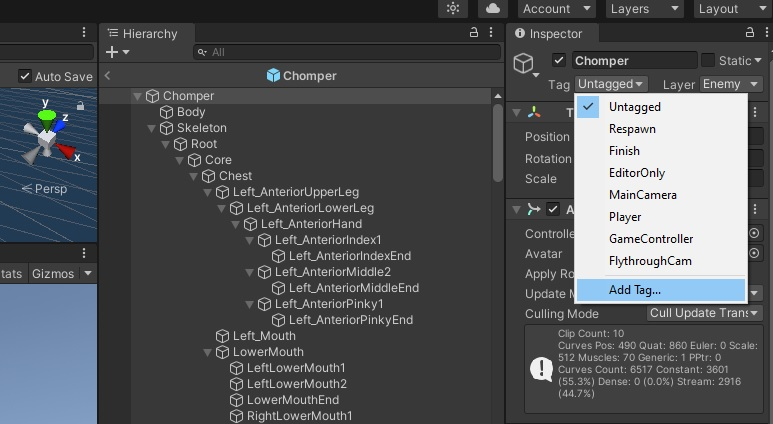

Now, click on the + icon to add a new tag, name your tag "Enemy" and click save. 

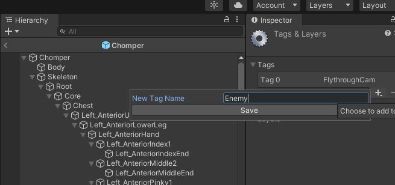

Now, click on your enemy prefab, and assign the Enemy tag to the "Tag" property. Do this for both the spitter and the chomper prefabs. 

Now, open your spawnEnemy script. 

First we need to create two variables, to track the number of enemies, and the wave number. At the top of the script, below were you create the variable for the enemyPrefabs array, add the following:

```c#
    //tracking enemys and waves
    public int enemyCount;
    public int waveNumer; 
```

Now, within Update() ,  we will check to see if all our enemies have been destroyed, by checking for the enemy tag, and creating a list of objects,  as follows. 

```c#
void Update()
    {
        //track enemy number and start the next wave if it = 0. 
        //gets the length of the list of  all objects with the enemy tag. 
        enemyCount = GameObject.FindGameObjectsWithTag("Enemy").Length;
        //increases wave number if 0 enemies found
        if (enemyCount == 0) { 
            waveNumer++; SpawnRandomEnemy(waveNumer);
            Debug.Log("Commening Wave Number " + waveNumer);
        }
    }
```

Now, we have added waveNumber as an argument to our SpawnRandomEnemy(); method, so we need to make sure it is expecting this argument. Back where we define our SpawnRandomEnemy() method, add in an integer argument called numberOfEnemies like this:

```
   void SpawnRandomEnemy(int numberOfEnemies)
```

Also, in Start(), when we call SpawnRandomEnemy(), we need to add in waveNumber as the argument:

```c#
void Start()
    {
        SpawnRandomEnemy(waveNumer); 
    }
```

Finally, we need to make the upper limit in our for loop in our SpawnRandomEnemy() match the number of enemies we want, by replacing the number 3 with our numberOfEnemies; argument as follows:

```c#
    void SpawnRandomEnemy(int numberOfEnemies)
    {
        for (int i = 0; i < numberOfEnemies; i++)
        {
           int enemyIndex = Random.Range(0, enemyPrefabs.Length);
            Instantiate(enemyPrefabs[enemyIndex], GenerateRandomPosition(), chomperPrefab.transform.rotation);
        }
        
    }
```

Now, you should have an increasing number of enemies spawn in each time you kill all the enemies!

### Completed SpawnEnemy Script. 

```c#
using System.Collections;
using System.Collections.Generic;
using System.Threading;
using UnityEngine;

public class SpwanEnemy : MonoBehaviour
{
    public GameObject chomperPrefab;
    private float xRange = 20;
    private float zRange = 15;
    // creates an array for enemy prefabs
    public GameObject[] enemyPrefabs;
    //tracking enemys and waves
    public int enemyCount;
    public int waveNumer; 
    
    // Start is called before the first frame update
    void Start()
    {
        SpawnRandomEnemy(waveNumer); 
    }

    // Update is called once per frame
    void Update()
    {
        //track enemy number and start the next wave if it = 0. 
        //gets the length of the list of  all objects with the enemy tag. 
        enemyCount = GameObject.FindGameObjectsWithTag("Enemy").Length;
        //increases wave number if 0 enemies found
        if (enemyCount == 0) { 
            waveNumer++; SpawnRandomEnemy(waveNumer);
            Debug.Log("Commening Wave Number " + waveNumer);
        }

    }

    void SpawnRandomEnemy(int numberOfEnemies)
    {
        for (int i = 0; i < numberOfEnemies; i++)
        {
           int enemyIndex = Random.Range(0, enemyPrefabs.Length);
            Instantiate(enemyPrefabs[enemyIndex], GenerateRandomPosition(), chomperPrefab.transform.rotation);
        }
     }

    private Vector3 GenerateRandomPosition()
    {
        
        float spawnX = Random.Range(-xRange, xRange);
        float spawnZ = Random.Range(-zRange, zRange);
        Vector3 spawnPoint = new Vector3(spawnX, 0, spawnZ);
        return spawnPoint; 
    }
}

```

